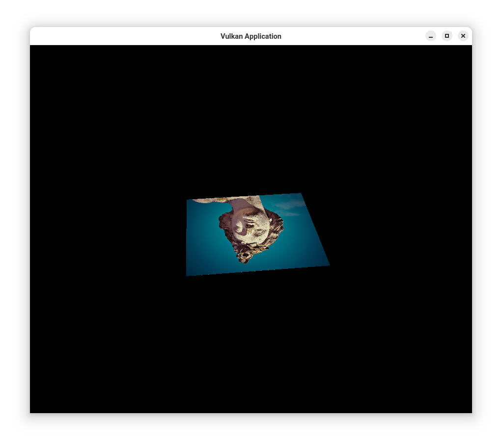

************
Vulkan Depth
************

This application implements an object-oriented approach to the 
`Vulkan Tutorial <https://vulkan-tutorial.com/>`_ up to the section on 
Textures. It features the rendering of a rotating textured square, 
support for dynamic window resizing, and zoom level adjustments.

This documentation will be updated for a package that also accounts
for Depth buffering

Overview
########

This repository serves as a foundational framework for developers who wish 
to build Vulkan-based applications. It follows the Vulkan Tutorial up to 
the point where texture mapping is introduced, providing an effective 
starting point for projects requiring texture support.

**Current Features:**

- **Texture Mapping:** Implements texture loading and sampling using 
  Vulkan's combined image samplers.
- **Uniform Buffer Objects (UBOs):** Supports dynamic updates to transformation 
  matrices, allowing the manipulation of view, model, and projection matrices 
  in real-time.
- **Dynamic Rendering:** Renders a rotating textured square and allows for 
  dynamic window resizing and zooming.
  
**Additional Features:**

- **Vulkan Memory Management:** Utilizes Vulkan Memory Allocator (VMA) for 
  efficient memory handling.
- **Command Buffers and Synchronization:** Leverages single-use command buffers 
  for texture uploads and transition operations, ensuring optimal GPU performance.

**Limitations:**

- This version does not implement depth buffering, mipmaps, or multi-threaded 
  rendering.

**UBO Functionality Enabled:**

- Allows dynamic updates to transformation matrices for individual objects.
- Supports view, model, and projection transformations in a single frame.

Development Status
##################

This repository is currently under development and is intended as a starting 
point for learning and small projects. Users are encouraged to add their own 
features, unit testing, and thread safety mechanisms using mutexes.

Contributing
############

This project is archived for internal purposes. However, if you wish to 
contribute, please contact the author to request authorization for a 
pull request.

License
#######

This software is developed under the MIT license.

Requirements
############

This library is developed and tested on macOS and Arch Linux operating systems. 
It requires the following tools and versions:

- `g++ 14.1.1` or `clang 16.0.6` compiler
- `CMake 3.29.6` or later
- `valgrind` for memory checking

Installation
############

This project is distributed under the MIT license, allowing anyone to use 
or contribute to the codebase with the express permission of the repository 
owner.

To use this repository, follow these steps:

1. Ensure that `git` and `cmake` are installed on your computer. The required 
   CMake version is 3.27.7 or later.

2. Clone the repository to your preferred directory with the following command:

   .. code-block:: bash

      git clone https://github.com/Jon-Webb-79/VulkanApplication.git VulkanApplication

3. Navigate to the appropriate script directory depending on your environment 
   (bash or zsh):

   .. code-block:: bash

      # For bash
      cd VulkanApplication/scripts/bash 
      
      # For zsh
      cd VulkanApplication/scripts/zsh 

4. Build the codebase with the following command:

   .. code-block:: bash

      # For bash
      bash debug.sh  

      # For zsh
      zsh debug.zsh

5. Navigate to the `VulkanApplication/build/debug` directory to run the debug 
   version of the application:

   .. code-block:: bash

      ./VulkanApplication

6. If all unit tests pass and no memory leaks are detected, you may proceed 
   to transform this codebase into a static or dynamic library, or copy the 
   `.cpp` and `.hpp` files to your own project.

7. If the debug build works correctly, create a release version by running 
   the following commands from the `scripts` directory:

   .. code-block:: bash

      zsh release.zsh
      ./VulkanApplication

